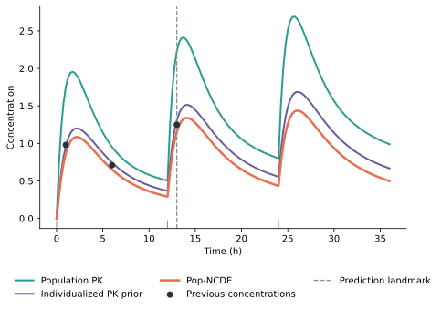

# popncde

`popncde` implements population neural controlled differential equations for individualized pharmacokinetic prediction from baseline covariates, known dosing history, and sparse concentration measurements.

## Requirements

- Python 3.10 or later
- Git
- Windows, macOS, or Linux

## Complete quick start on Windows

### 1. Open PowerShell

Open the Windows Start menu, search for `PowerShell`, and open it.

Create a separate folder for the demonstration and enter it:

```powershell
New-Item -ItemType Directory -Force "$HOME\popncde_demo"
Set-Location "$HOME\popncde_demo"
```

All model and figure files created below will be saved in this folder.

### 2. Install Pop-NCDE

Copy the following command exactly. The address is a plain GitHub address and must not contain Markdown brackets.

```powershell
python -m pip install --upgrade "git+https://github.com/haohaostats/popncde.git"
```

Confirm the installed version:

```powershell
python -c "import popncde; print(popncde.__version__)"
```

The expected version is `0.1.1` or later.

### 3. Run the included demonstration

```powershell
python -m popncde.demo
```

The command performs the complete workflow:

1. loads the included training patients, doses, and concentrations;
2. constructs the study data;
3. trains a small demonstration model;
4. uses three previous concentrations to individualize a new patient;
5. predicts concentrations from 0 to 36 hours;
6. calculates future exposure endpoints;
7. saves the model and prediction figure.

Successful execution ends with output similar to:

```text
Pop-NCDE demo completed
Model: C:\Users\username\popncde_demo\popncde_demo_model.pt
Figure: C:\Users\username\popncde_demo\popncde_demo_prediction.svg
Future endpoints: {...}
```

### 4. Open the generated figure

Run this command in PowerShell:

```powershell
Invoke-Item .\popncde_demo_prediction.svg
```

The generated files are:

```text
popncde_demo_model.pt
popncde_demo_prediction.svg
```

To display the current output folder, run:

```powershell
Get-Location
```

## PowerShell and Python are different environments

A PowerShell prompt normally begins with `PS`:

```text
PS C:\Users\username>
```

A Python prompt begins with `>>>`:

```text
>>>
```

Commands such as `Get-Location` and `Invoke-Item` must be entered in PowerShell, not after the Python `>>>` prompt.

To leave Python and return to PowerShell, enter:

```python
exit()
```

## Included demo data

The package contains six static CSV files. No data-generation program is included.

```text
patients.csv
doses.csv
concentrations.csv
new_patient.csv
known_doses.csv
previous_concentrations.csv
```

They represent:

| File | Contents |
| --- | --- |
| `patients.csv` | Baseline covariates for eight training patients |
| `doses.csv` | Known doses for the training patients |
| `concentrations.csv` | Observed training concentrations |
| `new_patient.csv` | Baseline covariates for one new patient |
| `known_doses.csv` | Known dosing schedule for the new patient |
| `previous_concentrations.csv` | Three previous concentrations for individualization |

## Step-by-step Python workflow

Start Python from PowerShell:

```powershell
python
```

Do not type the displayed `>>>` symbols. Enter the following Python commands after the prompt.

### 1. Import the required components

```python
import numpy as np
from popncde import PopNCDE, PopNCDEConfig, StudyData
from popncde import load_example_data, load_example_patient
```

### 2. Load and inspect the included training data

```python
patients, doses, concentrations = load_example_data()
print(patients)
print(doses)
print(concentrations)
```

### 3. Construct the study and train the model

```python
study = StudyData.from_frames(patients, doses, concentrations)
model = PopNCDE(PopNCDEConfig())
model.fit(study)
```

### 4. Load the example new patient

```python
new_patient, known_doses, previous_concentrations = load_example_patient()
prediction_times = np.arange(0.0, 36.01, 0.25)
```

### 5. Make an individualized prediction

```python
prediction = model.predict(
    patients=new_patient,
    doses=known_doses,
    concentrations=previous_concentrations,
    times=prediction_times,
    history_count=3,
)
```

The argument `history_count=3` means that the first three available concentrations are used for individualization. Later concentrations are not used as patient history.

### 6. Inspect the prediction and exposure endpoints

```python
print(prediction.frame)
print(prediction.future_endpoints())
```

The prediction table contains:

| Column | Meaning |
| --- | --- |
| `time_h` | Prediction time in hours |
| `population_pk` | Covariate-adjusted population PK trajectory |
| `individualized_prior` | Individualized PK prior |
| `prediction` | Final Pop-NCDE prediction |

The endpoint output contains future AUC, future maximum concentration, and the final predose concentration.

Expected prediction output with the included data and default configuration:

```text
     time_h  population_pk  individualized_prior  prediction
0      0.00       0.000000              0.000000    0.000000
1      0.25       0.706682              0.352768    0.292105
2      0.50       1.201535              0.620724    0.544054
3      0.75       1.536754              0.820638    0.731434
4      1.00       1.752462              0.966169    0.867464
..      ...            ...                   ...         ...
140   35.00       1.041488              0.713847    0.541778
141   35.25       1.027340              0.701456    0.530135
142   35.50       1.013735              0.689568    0.518943
143   35.75       1.000628              0.678147    0.508174
144   36.00       0.987977              0.667164    0.497800

[145 rows x 4 columns]
```

Expected future endpoint output:

```text
{'future_auc': 20.598982740193605,
 'future_cmax': 1.437605857849121,
 'final_predose': 0.43403851985931396}
```

### 7. Save and open the prediction figure

```python
figure, axes = prediction.plot()
figure.savefig("my_prediction.svg", bbox_inches="tight")
```

The SVG file is saved in the folder from which Python was started. Display its full path and open it directly from Python:

```python
import os
print(os.path.abspath("my_prediction.svg"))
os.startfile("my_prediction.svg")
```

`os.startfile` is available on Windows. On macOS or Linux, leave Python with `exit()` and open the SVG using the system file browser.

The resulting vector figure is shown below:



### 8. Save the fitted model

```python
model.save("popncde.pt")
```

### 9. Return to PowerShell

```python
exit()
```

## Why the two demonstrations may produce different numbers

`python -m popncde.demo` uses a deliberately reduced training configuration so that installation can be checked quickly. The step-by-step workflow uses the default `PopNCDEConfig()` settings. The two runs can therefore produce different predictions and exposure endpoints. This is expected.

## Data format for a new study

The package accepts three pandas data frames:

```text
patients:       patient_id, age_y, sex_male, weight_kg, egfr_ml_min
doses:          patient_id, time_h, dose_mg
concentrations: patient_id, time_h, concentration
```

Training and validation sets are separated at the patient level. Users may provide this assignment through a `split` column in the patient table. Otherwise, the package randomly assigns 15% of patients to validation using the configured random seed.

```python
from popncde import PopNCDE, PopNCDEConfig, StudyData

study = StudyData.from_frames(patients, doses, concentrations)
model = PopNCDE(PopNCDEConfig())
model.fit(study)

prediction = model.predict(
    patients=new_patient,
    doses=known_doses,
    concentrations=previous_concentrations,
    times=prediction_times,
    history_count=3,
)

figure, axes = prediction.plot()
print(prediction.future_endpoints())
model.save("popncde.pt")
```

## Common problems

### `SyntaxError` after entering `Invoke-Item`

The command was entered inside Python. Run `exit()` first, then enter `Invoke-Item` at the PowerShell prompt.

### `NameError: name 'Get' is not defined`

`Get-Location` was entered inside Python. Run `exit()` and enter it in PowerShell.

### The figure cannot be found

In Python, run:

```python
import os
print(os.getcwd())
print(os.path.abspath("my_prediction.svg"))
```

In PowerShell, search the current folder with:

```powershell
Get-ChildItem -Path . -Filter "*.svg"
```
